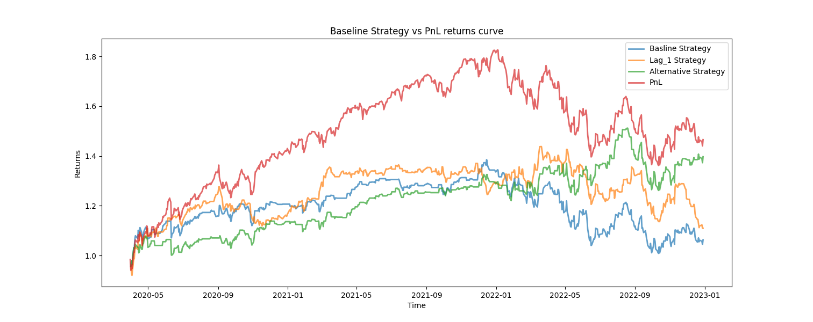

# Next-Day Market Direction Prediction using Regime Features

**In-depth description regarding the project is available in the pdf file in the repository.**

## Project Overview
This project explores a quantitative approach to predict the next-day market direction of the S&P 500 index, by implementing a regime-conditioned features. It implements various statistical factors to filter market states, followed by a Random Forest classifier to capture the alpha.

## Key Methodology
This project implements a structured pipeline for financial machine learning:

## Feature Engineering
Beyod the naive price lags, the model constructs features by using statistical analysis.
**Momentum and Volatility**: 10-day and 20-day momentum, momentum ratio, and rolling volatility to capture market states.
**Market Regime**: collects data from the VIX index to evaluate the market regime.

### Modeling Framework
* **Classifier**: A random forest classifier was chosen because it is a relatively accessible and well-established model, and because it was presented in the book *Advances in Financial Machine Learning* by **Marcos Lopez de Prado** as one of the fundamental machine learning methods for financial applications.

## Metrics
| Metric | Alternative Strategy (Model) | Baseline Strategy |
| :--- | :---: | :---: |
| **Annualized Return** | 14.79% | 3.93% |
| **Sharpe Ratio** | 0.72 | 0.12 |
| **Max Drawdown** | -16.55% | -27.2% |
| **Hit Ratio** | 51.6% | 49.2% |

*(The model demonstrated significant risk-adjusted outperformance, particularly in reducing the Max Drawdown by ~40% compared to the benchmark.)*

## Tech Stack
* **Language**: Python
* **Libraries**: `pandas`, `numpy`, `scikit-learn`, `matplotlib`, `yfinance`
* **Methodological Influence**: Inspired by the frameworks of **Marcos Lopez de Prado** (*Advances in Financial Machine Learning*).

